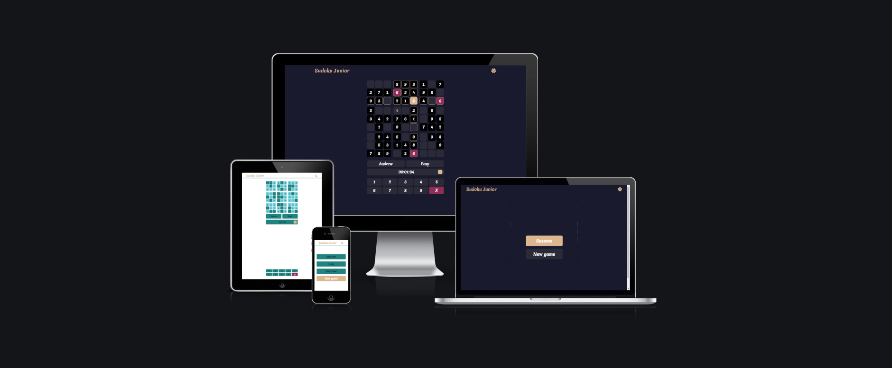
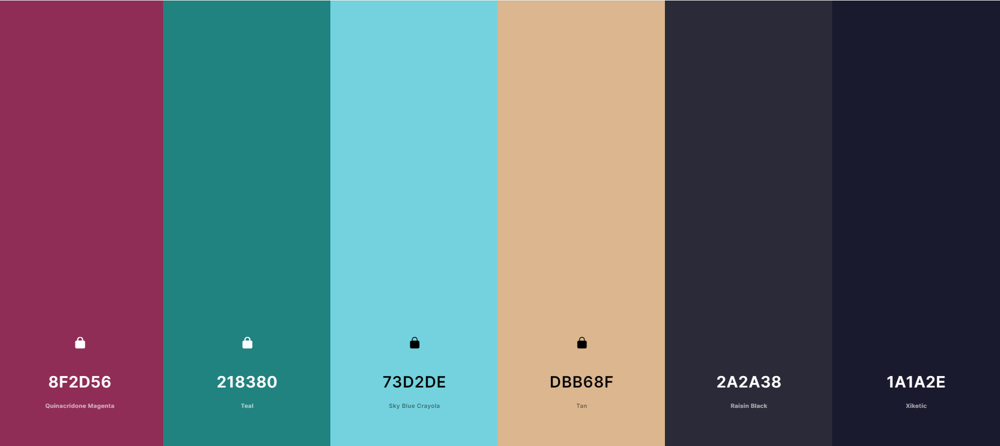
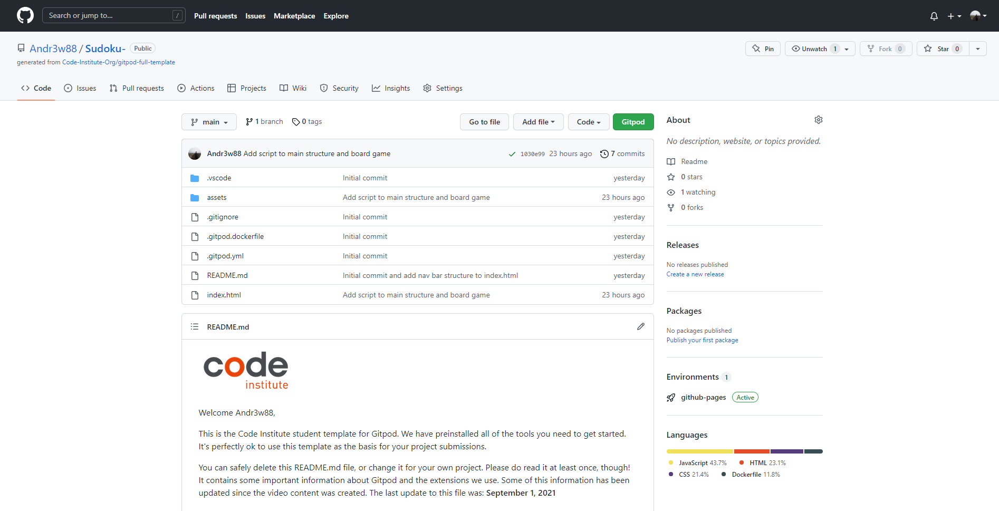
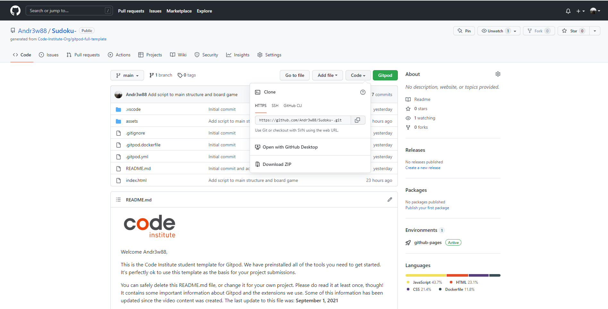

# **_Sudoku_**
How to play Sudoku -->
https://sudoku.com/how-to-play/sudoku-rules-for-complete-beginners/

Welcome to <a href="https://andr3w88.github.io/Sudoku-/" target="_blank">Sudoku</a>

# Contents

* [**User Experience UX**](<#user-experience-ux>)
    * [Site Structure](<#site-structure>)
    * [Design Choices](<#design-choices>)
    *  [Typography](<#typography>)
    *  [Colour Scheme](<#colour-scheme>)
* [**Technologies Used**](<#technologies-used>)
* [**Testing**](<#testing>)
* [**Deployment**](<#deployment>)
* [**Credits**](<#credits>)
    * [**Content**](<#content>)
*  [**Acknowledgements**](<#acknowledgements>)

# User Experience (UX)
## Site Structure

Sudoku website have one main page index.html with 4 available screen [start-screen](https://andr3w88.github.io/Sudoku-/) is the default loading page, [game-screen](), [pause-screen](), [result-screen]() 

[Back to top](<#contents>)
## Design Choices

 * ### Typography
      The font chosen is 'Merienda' for the body text. They fall back to cursive and sans-serif respectively. 
      * 'Merienda' is a nice handwriting font being easy to read for all.

 * ### Colour Scheme
      The colour scheme eventually chosen was a mix of 6 colors.  

[Back to top](<#contents>)

# Technologies Used
* [HTML5](https://html.spec.whatwg.org/) - provides the content and structure for the website.
* [CSS](https://www.w3.org/Style/CSS/Overview.en.html) - provides the styling.
* [JS](https://www.javascript.com/) - provides the script
* [Gitpod](https://www.gitpod.io/#get-started) - used to deploy the website.
* [Github](https://github.com/) - used to host and edit the website.

[Back to top](<#contents>)

# Testing

Please refer to [**_here_**](TESTING.md) for more information on testing Sudoku

[Back to top](<#contents>)

# Deployment

### **To deploy the project**
The site was deployed to GitHub pages. The steps to deploy a site are as follows:
  1. In the GitHub repository, navigate to the **Settings** tab.
  2. Once in Settings, navigate to the **Pages** tab on the left hand side.
  3. Under **Source**, select the branch to **main**, then click **save**.
  4. Once the master branch has been selected, the page will be automatically refreshed with a detailed ribbon display to indicate the successful deployment.

  The live link to the Github repository can be found here - https://andr3w88.github.io/Sudoku-/

### **To fork the repository on GitHub**
A copy of the GitHub Repository can be made by forking the GitHub account. This copy can be viewed and changes can be made to the copy without affecting the original repository. Take the following steps to fork the repository;
1. Log in to **GitHub** and locate the [repository](https://github.com/Andr3w88/Sudoku-).
2. On the right hand side of the page inline with the repository name is a button called **'Fork'**, click on the button to create a copy of the original repository in your GitHub Account.

### **To create a local clone of this project**
The method from cloning a project from GitHub is below:

1. Under the repository’s name, click on the **code** tab.
2. In the **Clone with HTTPS** section, click on the clipboard icon to copy the given URL.

3. In your IDE of choice, open **Git Bash**.
4. Change the current working directory to the location where you want the cloned directory to be made.
5. Type **git clone**, and then paste the URL copied from GitHub.
6. Press **enter** and the local clone will be created.

[Back to top](<#contents>)

# Credits
### Content

* The font came from [Google Fonts](https://fonts.google.com/).
* The colour palate was compiled by [Coolors](https://coolors.co/).
* The icons came from [Font Awesome](https://fontawesome.com/).

# Acknowledgements
The site was completed as a Portfolio 2 Project piece for the Full Stack Software Developer (e-Commerce) Diploma at the [Code Institute](https://codeinstitute.net/). As such I would like to thank my mentor [Precious Ijege](https://www.linkedin.com/in/precious-ijege-908a00168/), the Slack community, and all at the Code Institute for their help and support. 
Andr3w88 2022.

[Back to top](<#contents>)