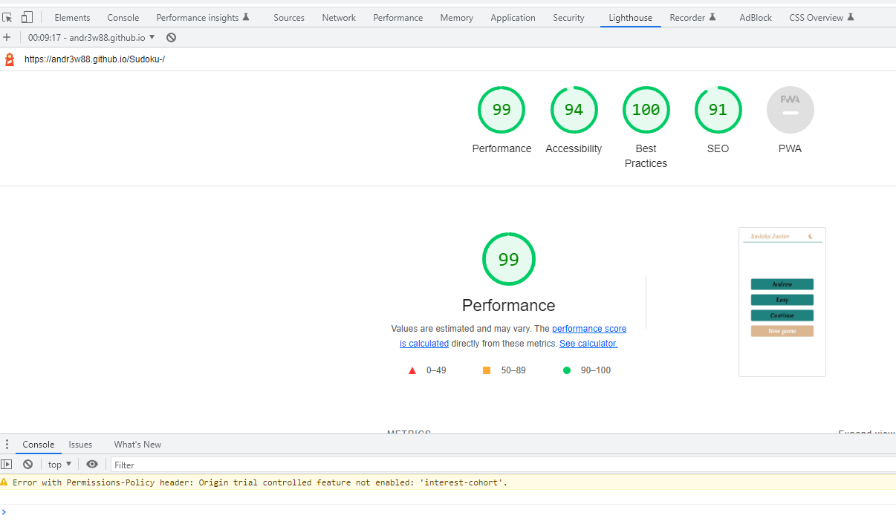

# **_TESTING_**
## **_Code Validation_**
Code Validation
The Sudoku site has be throughly tested. All the code has been run through the [W3C html Validator](<#https://validator.w3.org/>) and the [W3C CSS Validator](<#https://jigsaw.w3.org/css-validator/>). Minor errors were found on the home and inspiration pages. After a fix and retest, no errors were returned for both.

The HTML validator result:

* [**index.html**](./assets/images/html-validator.png)

The CSS validator result:

* [**css image**](./assets/images/css.validator.png)

The JS validator result:

* [**js image**](./assets/images/java-validator.png)
* [**js image**](./assets/images/js-validator.png)

### **_Lighthouse_**

The site was also tested using [**Google Lighthouse**](<#Google Lighthouse>)  in Chrome Developer Tools to test each of the pages for:

* Performance - How the page performs whilst loading.
* Accessibility - Is the site acccessible for all users and how can it be improved.
* Best Practices - Site conforms to industry best practices.
* SEO - Search engine optimisation. Is the site optimised for search engine result rankings.

As an example the results for Sudoku home page are below:

